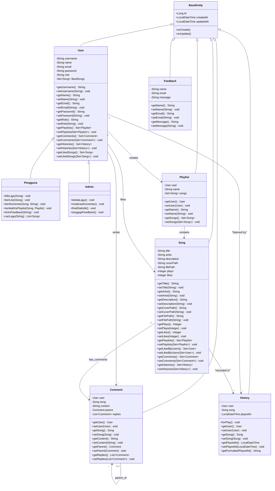

# Class Diagram - Music Streaming App

Berikut adalah diagram kelas (Class Diagram) berdasarkan kode sumber proyek, lengkap dengan atribut dan method-nya.

```mermaid
classDiagram
    class BaseEntity {
        +Long id
        +LocalDateTime createdAt
        +LocalDateTime updatedAt
        +onCreate()
        +onUpdate()
    }

    class User {
        -String username
        -String name
        -String email
        -String password
        -String role
        -Set~Song~ likedSongs
        +getUsername() String
        +setUsername(String) void
        +getName() String
        +setName(String) void
        +getEmail() String
        +setEmail(String) void
        +getPassword() String
        +setPassword(String) void
        +getRole() String
        +setRole(String) void
        +getPlaylists() Set~Playlist~
        +setPlaylists(Set~Playlist~) void
        +getComments() Set~Comment~
        +setComments(Set~Comment~) void
        +getHistories() Set~History~
        +setHistories(Set~History~) void
        +getLikedSongs() Set~Song~
        +setLikedSongs(Set~Song~) void
    }
    
    class Pengguna {
        +klikLagu(Song) void
        +beriLike(Song) void
        +beriKomentar(Song, String) void
        +tambahKePlaylist(Song, Playlist) void
        +kirimFeedback(String) void
        +cariLagu(String) List~Song~
    }

    class Admin {
        +kelolaLagu() void
        +moderasiKomentar() void
        +lihatStatistik() void
        +tanggapiFeedback() void
    }

    class Song {
        -String title
        -String artist
        -String description
        -String coverPath
        -String filePath
        -Integer plays
        -Integer likes
        +getTitle() String
        +setTitle(String) void
        +getArtist() String
        +setArtist(String) void
        +getDescription() String
        +setDescription(String) void
        +getCoverPath() String
        +setCoverPath(String) void
        +getFilePath() String
        +setFilePath(String) void
        +getPlays() Integer
        +setPlays(Integer) void
        +getLikes() Integer
        +setLikes(Integer) void
        +getPlaylists() Set~Playlist~
        +setPlaylists(Set~Playlist~) void
        +getLikedByUsers() Set~User~
        +setLikedByUsers(Set~User~) void
        +getComments() Set~Comment~
        +setComments(Set~Comment~) void
        +getHistories() Set~History~
        +setHistories(Set~History~) void
    }

    class Playlist {
        -User user
        -String name
        -Set~Song~ songs
        +getUser() User
        +setUser(User) void
        +getName() String
        +setName(String) void
        +getSongs() Set~Song~
        +setSongs(Set~Song~) void
    }

    class Comment {
        -User user
        -Song song
        -String content
        -Comment parent
        -List~Comment~ replies
        +getUser() User
        +setUser(User) void
        +getSong() Song
        +setSong(Song) void
        +getContent() String
        +setContent(String) void
        +getParent() Comment
        +setParent(Comment) void
        +getReplies() List~Comment~
        +setReplies(List~Comment~) void
    }

    class History {
        -User user
        -Song song
        -LocalDateTime playedAt
        #onPlay() void
        +getUser() User
        +setUser(User) void
        +getSong() Song
        +setSong(Song) void
        +getPlayedAt() LocalDateTime
        +setPlayedAt(LocalDateTime) void
        +getFormattedPlayedAt() String
    }

    class Feedback {
        -String name
        -String email
        -String message
        +getName() String
        +setName(String) void
        +getEmail() String
        +setEmail(String) void
        +getMessage() String
        +setMessage(String) void
    }

    %% Inheritance
    BaseEntity <|-- User
    BaseEntity <|-- Song
    BaseEntity <|-- Playlist
    BaseEntity <|-- Comment
    BaseEntity <|-- History
    BaseEntity <|-- Feedback
    
    User <|-- Pengguna
    User <|-- Admin

    %% Relationships
    User "1" --> "*" Playlist : creates
    Playlist "*" --> "*" Song : contains
    User "*" --> "*" Song : likes
    
    User "1" --> "*" Comment : writes
    Song "1" --> "*" Comment : has_comments
    Comment "0..1" --> "*" Comment : parent_of
    
    User "1" --> "*" History : "listened by"
    Song "1" --> "*" History : "recorded in"
```
